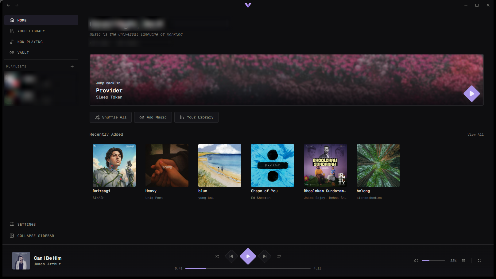
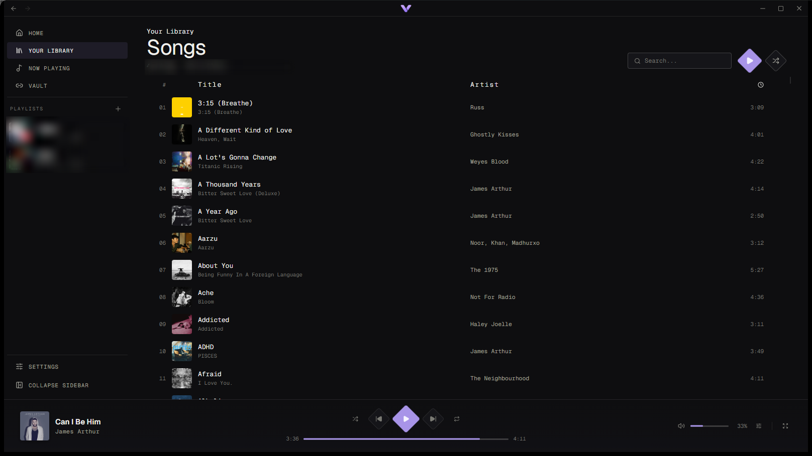
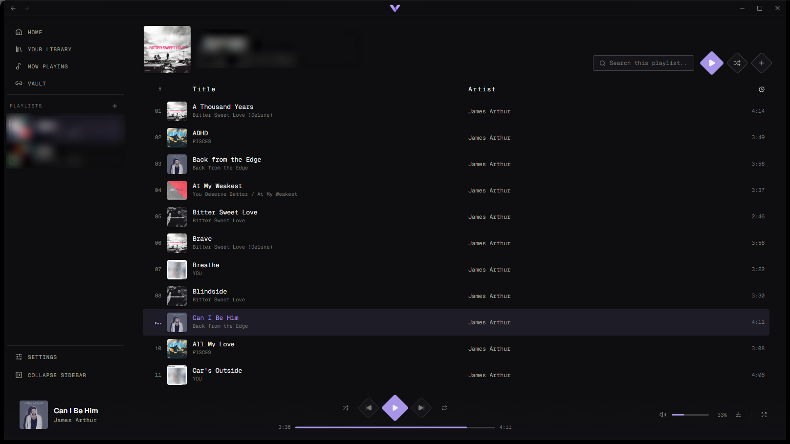
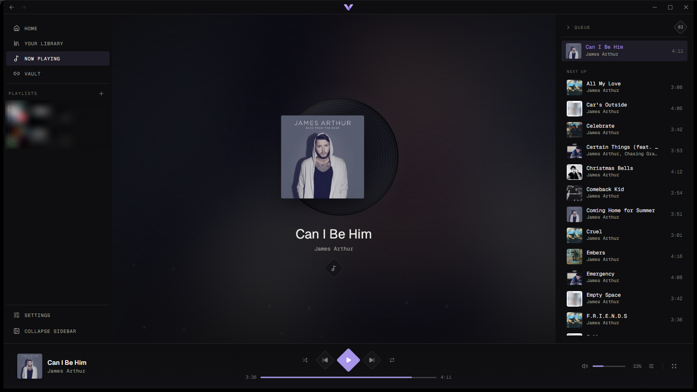
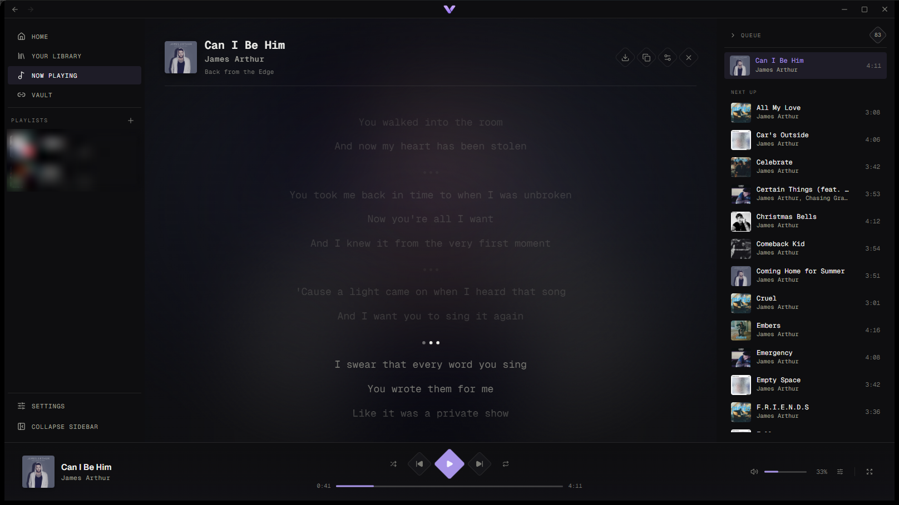
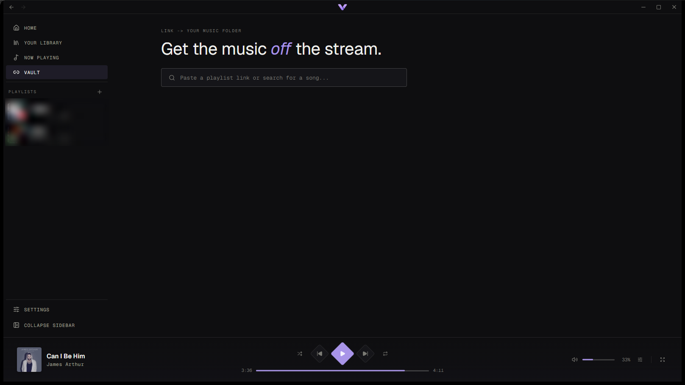
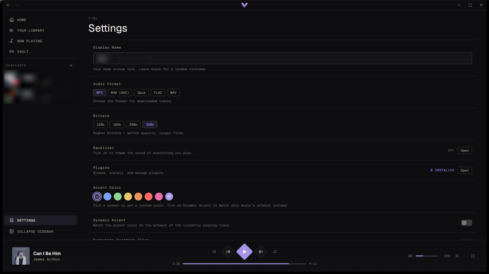

# Vynl

A Minimal Music Player built with Tauri, Svelte, and Rust.

## Screenshots

### Home



### Library



### Playlist



### Now Playing



### Synced Lyrics



### Vault



### Settings



## Features

- Playlists, albums, and single tracks from supported links
- Configurable output: MP3, M4A, Opus, FLAC, WAV with bitrate selection
- Embedded cover art and metadata
- Parallel downloads with progress tracking
- Auto-installs `yt-dlp` and `ffmpeg`

### Player

- Built-in audio player with play/pause/seek/volume
- Queue management with reorder and remove
- Fullscreen player mode
- Persistent "Now Playing" state

### Library & Playlists

- Library scanning with incremental cache updates
- Create, rename, delete playlists
- Add/remove/reorder tracks
- Custom playlist cover art

### Lyrics

- Synced (LRC) and plain text lyrics
- Multi-source fetching (LRCLIB, lyrics.ovh)
- Lyrics embedding into audio files
- Lyrics overlay in the player

### Integration & UX

- Discord Rich Presence
- System tray
- Auto-updater
- Launch at startup
- Accent color theming
- i18n support

### Plugins

- Plugin runtime (JavaScript/TypeScript) with `onLoad`/`onEnable`/`onDisable`/`onUnload` lifecycle hooks
- Built-in plugin store: search, categories, one-click install, auto-updates
- Providers for lyrics, artist info, and collection resolution
- Plugin-contributed settings sections, Home page sections, and full pages
- Player observation + shared playback control (gated by a `player` permission)
- Dev folder installs with live reload, plus `.zip` sideloading
- **Listen Along** — real-time synchronized listening sessions (host a session, share a code, friends follow your playback) — ships as a store plugin in [vynl-store](https://github.com/DevX32/vynl-store/tree/main/plugins/listen-along)

## Platform Support

| Platform | Status |
| -------- | ------ |
| Windows  | Supported |
| Linux    | Supported |

## Development

```bash
# Install dependencies
bun install

# Start dev server
bun run tauri:dev
```

### Prerequisites

- [Rust](https://rustup.rs/) (via `rustup`)
- [Bun](https://bun.sh/) (or npm) — installs the local `@tauri-apps/cli` automatically

## Scripts

| Command | Description |
| ------- | ----------- |
| `bun run dev` | Vite dev server (frontend only) |
| `bun run tauri:dev` | Full Tauri app with hot reload |
| `bun run build` | Build frontend to `web/dist/` |
| `bun run tauri:build` | Build and package for current platform |
| `bun run typecheck` | TypeScript + Svelte checks |

## License

MIT